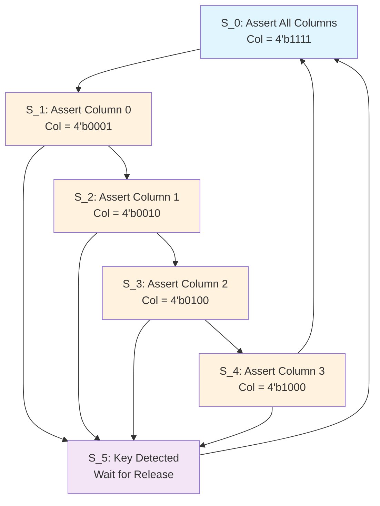

# 🔢 Hexadecimal Keypad Controller - VLSI Design

[](https://www.systemverilog.io/)
[](LICENSE)
[](hex_keypad_waveform.vcd)

> **A comprehensive SystemVerilog implementation of a 4×4 hexadecimal keypad controller with Grayhill 072 interface compatibility**

## 📋 Table of Contents

- [🔍 Overview](#-overview)
- [🏗️ Architecture](#️-architecture)
- [🔌 Circuit Diagram](#-circuit-diagram)
- [📁 Project Structure](#-project-structure)
- [⚡ Features](#-features)
- [🚀 Applications](#-applications)
- [🛠️ Getting Started](#️-getting-started)
- [📊 Simulation Results](#-simulation-results)
- [📚 Technical Specifications](#-technical-specifications)
- [🤝 Contributing](#-contributing)
- [👨‍💻 Author](#-author)

## 🔍 Overview

This project implements a robust hexadecimal keypad controller designed in SystemVerilog for VLSI applications. The design features a sophisticated state machine-based approach to handle 4×4 matrix keypad scanning, debouncing, and key code generation compatible with Grayhill 072 interface standards.


### Key Highlights

- ✅ **State Machine Design**: Six-state FSM with one-hot encoding
- ✅ **Matrix Scanning**: Efficient column-wise scanning algorithm
- ✅ **Synchronization**: Built-in debouncing and synchronization logic
- ✅ **Hexadecimal Support**: Full 0-F key mapping (16 keys)
- ✅ **Industry Standard**: Grayhill 072 compatibility

## 🏗️ Architecture

The design consists of three main modules working in harmony:

```
┌─────────────────────────────────────────────────────────┐
│                    System Architecture                  │
├─────────────────────────────────────────────────────────┤
│                                                         │
│  ┌─────────────┐    ┌──────────────┐    ┌─────────────┐ │
│  │             │    │              │    │             │ │
│  │ Row_Signal  │◄──►│ Hex_Keypad   │◄──►│Synchronizer │ │
│  │   Module    │    │ Grayhill_072 │    │   Module    │ │
│  │             │    │              │    │             │ │
│  └─────────────┘    └──────────────┘    └─────────────┘ │
│                                                         │
└─────────────────────────────────────────────────────────┘
```

### 🔧 Module Descriptions

| Module | Function | Key Features |
|--------|----------|--------------|
| **Hex_Keypad_Grayhill_072** | Main controller with FSM | 6-state machine, column scanning, code generation |
| **Row_Signal** | Row detection logic | Combinational logic for key assertion detection |
| **Synchronizer** | Signal conditioning | Clock-based debouncing and synchronization |

## 🔌 Circuit Diagram

### Keypad Matrix Layout

```
        Col[0]  Col[1]  Col[2]  Col[3]
        ┌─────┬─────┬─────┬─────┐
Row[0]  │  0  │  1  │  2  │  3  │
        ├─────┼─────┼─────┼─────┤
Row[1]  │  4  │  5  │  6  │  7  │
        ├─────┼─────┼─────┼─────┤
Row[2]  │  8  │  9  │  A  │  B  │
        ├─────┼─────┼─────┼─────┤
Row[3]  │  C  │  D  │  E  │  F  │
        └─────┴─────┴─────┴─────┘
```

### State Machine Diagram



### Interface Signals

| Signal | Direction | Width | Description |
|--------|-----------|-------|-------------|
| `Row[3:0]` | Input | 4-bit | Row signals from keypad matrix |
| `S_Row` | Input | 1-bit | Synchronized row detection |
| `clock` | Input | 1-bit | System clock |
| `reset` | Input | 1-bit | Asynchronous reset |
| `Code[3:0]` | Output | 4-bit | Hexadecimal key code (0-F) |
| `Valid` | Output | 1-bit | Key press validation signal |
| `Col[3:0]` | Output | 4-bit | Column drive signals |

## 📁 Project Structure

```
Hexadecimal_keypad/
├── 📄 design.sv              # Main SystemVerilog design file
├── 📄 testbench.sv           # Comprehensive testbench
├── 📄 README.md              # This documentation
├── 📄 run.sh                 # Simulation script
├── 📄 library.cfg            # Library configuration
├── 📄 dataset.asdb           # Design dataset
├── 📊 hex_keypad_waveform.vcd # Simulation waveform output
├── 📁 work/                  # Compilation workspace
└── 📁 ACCELLERA_OVL_VHDL_LIB/ # Verification libraries
```

## ⚡ Features

### 🎯 Core Features

- **Matrix Scanning Algorithm**: Sequential column activation for key detection
- **One-Hot State Encoding**: Efficient and safe state representation
- **Debouncing Logic**: Hardware-based key bounce elimination
- **Real-time Processing**: Clock-synchronized operation
- **Full Hexadecimal Support**: 16-key mapping (0-9, A-F)

### 🔒 Robust Design

- **Asynchronous Reset**: Safe system initialization
- **Edge-triggered Logic**: Proper timing control
- **Modular Architecture**: Easy to understand and modify
- **Industry Compatibility**: Grayhill 072 interface standard

## 🚀 Applications

### 🏭 Industrial Applications

- **🏭 Process Control Systems**: HMI interfaces for industrial automation
- **🔧 Test Equipment**: Manual input for measurement instruments
- **🏗️ Building Automation**: Access control and HVAC systems
- **⚡ Power Systems**: Substation control and monitoring

### 💻 Embedded Systems

- **🖥️ Microcontroller Interfaces**: Direct connection to MCU GPIO
- **📟 Digital Displays**: Menu navigation and data entry
- **🎮 Gaming Devices**: Input mechanism for embedded games
- **📱 IoT Devices**: Local configuration and control interface

### 🎓 Educational Use Cases

- **📚 VLSI Learning**: Understanding FSM design and matrix scanning
- **🔬 Digital Logic Labs**: Practical implementation of combinational and sequential circuits
- **👨‍🎓 Computer Engineering**: Hardware-software interface design
- **🧪 Prototyping**: Base design for custom keypad controllers

### 🏥 Specialized Applications

- **🏥 Medical Devices**: Patient monitoring system inputs
- **🚗 Automotive**: Dashboard control interfaces
- **🏠 Home Automation**: Smart home control panels
- **🔐 Security Systems**: Alarm and access code entry

## 🛠️ Getting Started

### Prerequisites

- SystemVerilog compatible simulator (ModelSim, Vivado, etc.)
- Waveform viewer (GTKWave, ModelSim, etc.)
- Basic knowledge of digital design and Verilog/SystemVerilog

### Quick Start

1. **Clone the repository**
   ```bash
   git clone <repository-url>
   cd Hexadecimal_keypad
   ```

2. **Run simulation**
   ```bash
   # On Unix/Linux system
   ./run.sh
   
   # On Windows (if using bash)
   bash run.sh
   ```

3. **View waveforms**
   ```bash
   gtkwave hex_keypad_waveform.vcd
   ```

### Simulation Parameters

- **Clock Period**: 10ns (100MHz)
- **Reset Duration**: 10ns
- **Test Duration**: 2000ns
- **Key Press Duration**: 60ns
- **Key Release Duration**: 20ns

## 📊 Simulation Results

The testbench systematically tests all 16 keys (0-F) with the following sequence:

1. **Initialization**: System reset and clock setup
2. **Sequential Testing**: Each key pressed for 60ns, released for 20ns.
3. **Validation**: `Valid` signal assertion and correct `Code` output
4. **Waveform Generation**: Complete timing diagram in VCD format

### Expected Outputs

| Key Pressed | Code Output | Valid Signal | Col Pattern | Row Pattern |
|-------------|-------------|--------------|-------------|-------------|
| 0 | 4'h0 | 1 | 4'b0001 | 4'b0001 |
| 1 | 4'h1 | 1 | 4'b0010 | 4'b0001 |
| ... | ... | ... | ... | ... |
| F | 4'hF | 1 | 4'b1000 | 4'b1000 |

## 📚 Technical Specifications

### Timing Characteristics

- **Setup Time**: 2ns before clock edge
- **Hold Time**: 1ns after clock edge
- **Clock-to-Output Delay**: 3ns maximum
- **Reset Recovery Time**: 5ns minimum

### State Machine Encoding

```systemverilog
parameter S_0 = 6'b000001,  // Scan all columns
          S_1 = 6'b000010,  // Scan column 0
          S_2 = 6'b000100,  // Scan column 1
          S_3 = 6'b001000,  // Scan column 2
          S_4 = 6'b010000,  // Scan column 3
          S_5 = 6'b100000;  // Key detected state
```

### Key Mapping Table

| Physical Key | Binary Code | Hexadecimal | Row | Column |
|--------------|-------------|-------------|-----|--------|
| 0 | 0000 | 0x0 | 0 | 0 |
| 1 | 0001 | 0x1 | 0 | 1 |
| 2 | 0010 | 0x2 | 0 | 2 |
| 3 | 0011 | 0x3 | 0 | 3 |
| 4 | 0100 | 0x4 | 1 | 0 |
| 5 | 0101 | 0x5 | 1 | 1 |
| 6 | 0110 | 0x6 | 1 | 2 |
| 7 | 0111 | 0x7 | 1 | 3 |
| 8 | 1000 | 0x8 | 2 | 0 |
| 9 | 1001 | 0x9 | 2 | 1 |
| A | 1010 | 0xA | 2 | 2 |
| B | 1011 | 0xB | 2 | 3 |
| C | 1100 | 0xC | 3 | 0 |
| D | 1101 | 0xD | 3 | 1 |
| E | 1110 | 0xE | 3 | 2 |
| F | 1111 | 0xF | 3 | 3 |

## 🤝 Contributing

Contributions are welcome! Please feel free to submit pull requests or open issues for:

- Bug fixes and improvements
- Additional features (e.g., multiple key press detection)
- Documentation enhancements
- Test case additions
- Performance optimizations

